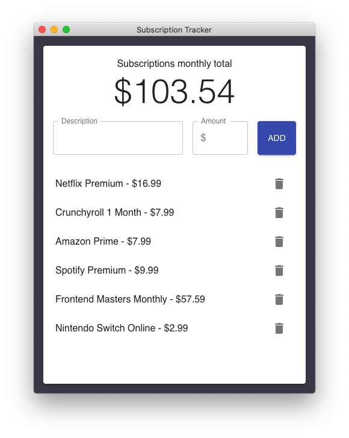

# subscription-tracker-electron

A subscription tracker, built with Electron and React, just so I know why I am broke (but caught up on all the TV shows and stuff).

This project is inspired by the great [Cassidy Williams](https://github.com/cassidoo)'s project [todometer](https://github.com/cassidoo/todometer).



## Download

Say whaaat? You want to download this? Go grab the latest version from the [Releases](https://github.com/davinakano/subscription-tracker-electron/releases) page!

It is available for macOS, Windows and Linux!

## Development

- Clone the repo:

```bash
$ git clone https://github.com/davinakano/subscription-tracker-electron.git
```

- Go to the project directory and install dependencies:

```bash
$ cd todometer && yarn install
```

To show the Electron application window with your current build:

```bash
$ yarn run electron-dev
```

To build a production-version:

```bash
$ yarn install
$ yarn postinstall
$ yarn pre-electron-pack
$ yarn electron-pack
```
